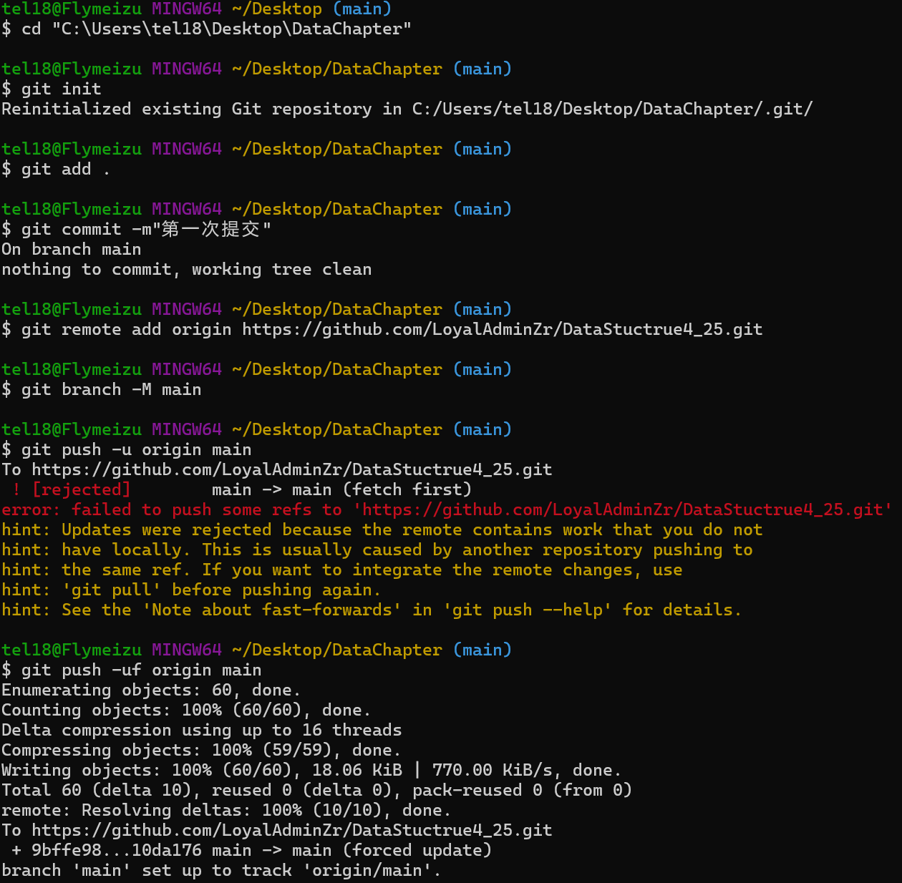

1. git config --global user.name 'Adminrui'
2. git config --global user.email  '2807454430@qq.com'
3. git add +文件名称
   输入cd+文件名 进入文件在进行编辑

   
4. git add index.js
5. git commit index.js 【提交单个文件】

git commit -m 'add index.js'   【都提交 需要在输入-m'提交信息：即本次修改信息'】

git push

git pull

git checkout index.js  分支/从本地仓库恢复误删文件（误删工作区代码）【远程仓库，工作区，本地仓库 git分为三个部分】

终端查看git跟踪

将本地文件通过git上传到GitHub：

1. cd "C:\Users\tel18\Desktop\DataChapter"【引号内为电脑上传文件地址】
2. 初始化本地Git仓库：git init
3. 添加文件到暂存区：git add .
4. 提交更改到本地仓库：git commit -m"第一次提交"
5. 关联远程仓库（Github）复制https或ssh地址：git remote add origin https://github.com/LoyalAdminZr/DataStuctrue4_25.git
6. 推送文件至GitHub：git branch -M main【确保分支名为main】AND  git push -u origin main 【首次推送】
7. 推送被拒绝，因为含有初始文件（如READNME.md或LICENSE文件）或GIt 拒绝直接覆盖远程仓库的历史记录，以下有一些解决方法：

* git push -uf origin main / git push -u origin main --force【强制推送完全覆盖，仅限个人仓库】
* git pull origin main --rebase 【先拉取远程内容并和并】-->git add .【添加解决冲突后的文件】--> git rebase --continue【继续合并】-->git push -u origin main 【重新推送】
* git fetch origin 【获取远程最新内容】 ---> git reset --hard origin/main 【强制本地与远程一致,会丢失本地未提交的修改！】 -->git push -u origin main 【推送】
* 提醒：确保本地分支名与远程一致，通常为main或master

### Markdown基本语法

1. hello world！
