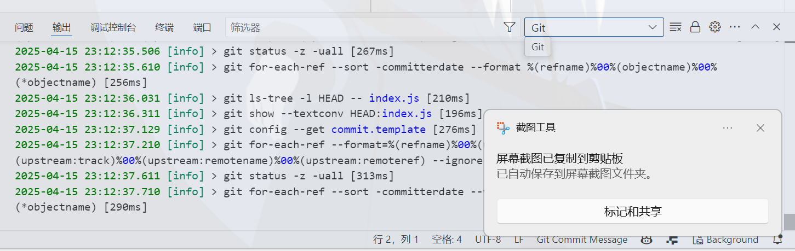

1. git config --global user.name 'Adminrui'
2. git config --global user.email  '2807454430@qq.com'
3. git add +文件名称
   输入cd+文件名 进入文件在进行编辑

   
4. git add index.js
5. git commit index.js 【提交单个文件】

git commit -m 'add index.js'   【都提交 需要在输入-m'提交信息：即本次修改信息'】

git push

git pull

git checkout index.js  分支/从本地仓库恢复误删文件（误删工作区代码）【远程仓库，工作区，本地仓库 git分为三个部分】

终端查看git跟踪

查看具体提交了什么需要插件：

* CSS Peek 【html与css关联】
*
